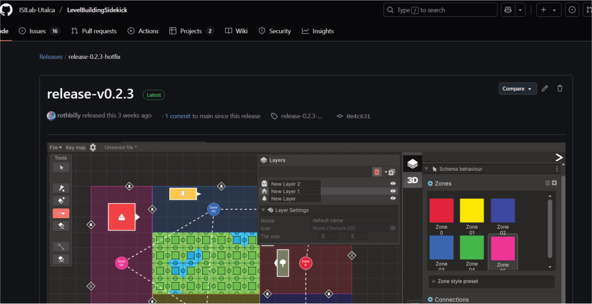
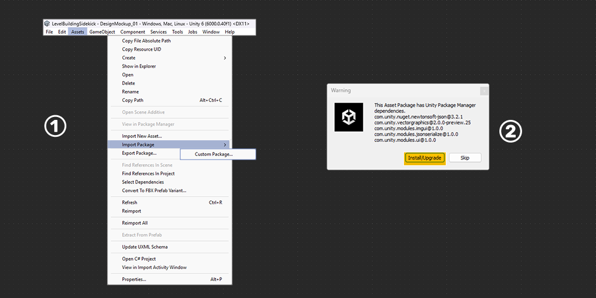
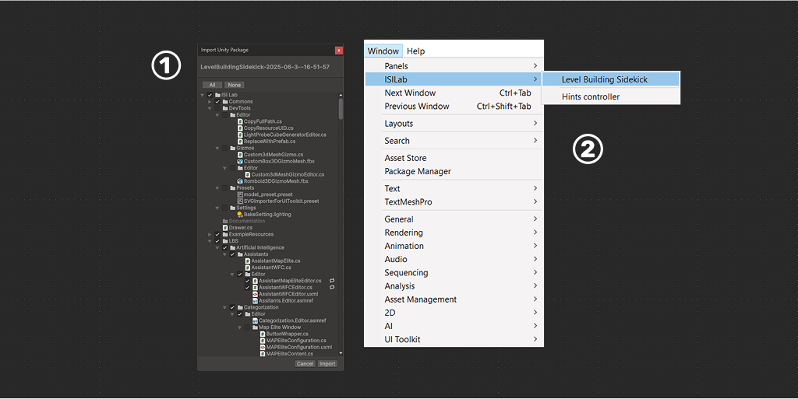

+++
date = '2025-04-07T12:18:20-04:00'
draft = false
title = '1. LBS - Installation'
tag = ["Documentation","Tutorial","LBS"]
weight = 10
showtoc = true
tocopen = true
+++

LBS, an extension for Unity Engine, follows a standard installation process similar to other Unity extensions. Below are the necessary steps for installation:

### Current release

> LBS V0.4.0 For Unity version 6000.0.40f1

[Download! and repository site!](https://github.com/ISILab-Utalca/LevelBuildingSidekick/releases/tag/release-0.4.0-quests)

---

### How to install!

System Requirements: This extension is developed to be compatible with **Unity 6 versions 6000.0.40f1** or higher. To start the installation, it is required to download some packages like `newtonsoft.JSON`. The engine will recognize the package and open a window that will facilitate its import.

1. **A:** To import LBS, go to the toolbar: **Assets > Import Package > Custom Package**.
1. **B:** In the file browser select the downloaded package  `LevelBuildingSidekick-2025-06-3--16-51-57.unitypackage
 ` file and click **Open.**
2. The indicated packages must be imported for LBS to function properly. Clicking on **Install/Upgrade** will automatically install the required packages.

1. To include the “LBSPackage” package in your project, you need to double-click on the file with the Unity project open. Unity will automatically recognize it and ask what you want to include. Click “IMPORT”, and the project import is ready.
2. To start working click on the `Window` tab, go to the `ISILab` section and then click on `Level Building Sidekick`, to bring up the tool's working window.