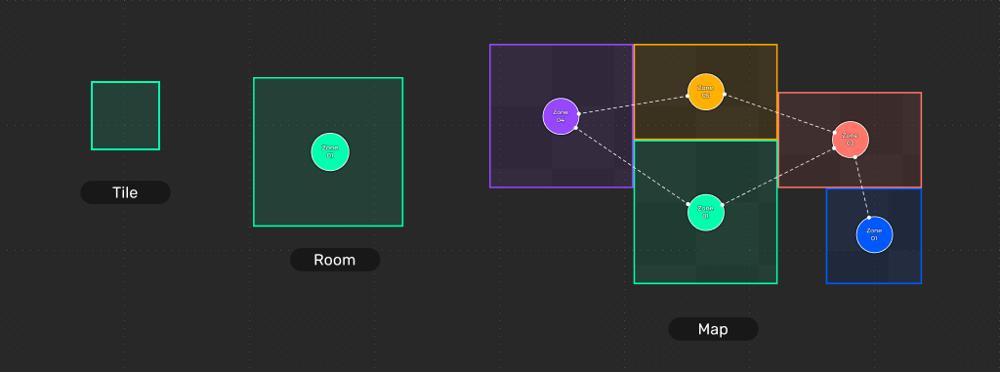
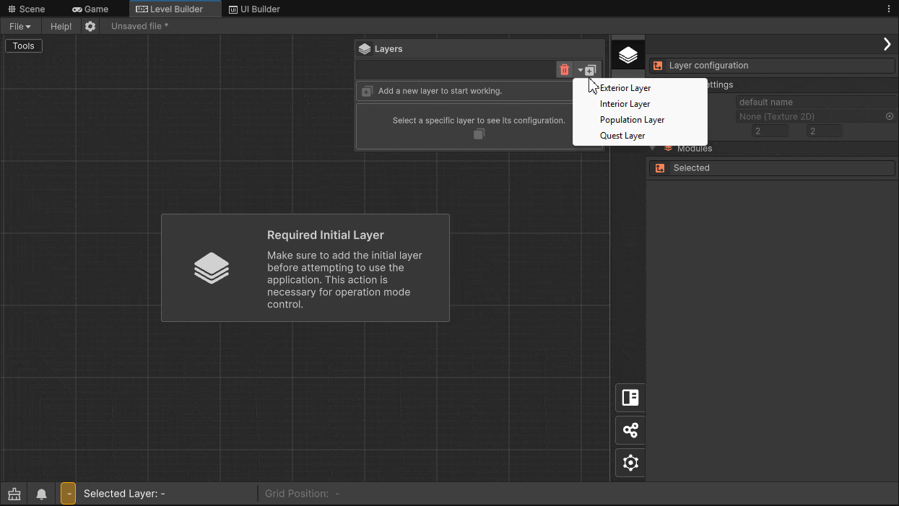
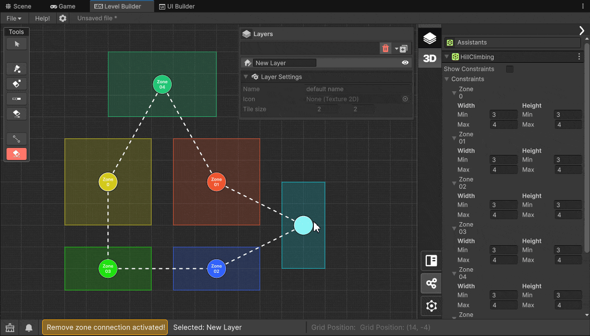
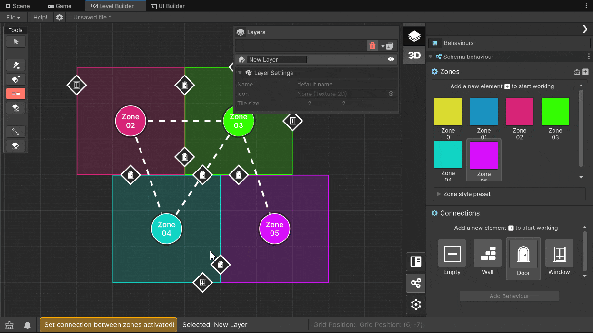

+++
date = "2025-04-22T17:02:57.752Z"
draft = false
title = "LBS - Module 1A Dungeon Generation "
weight = 20
showtoc = true
tocopen = true
tags = [ "Documentation", "LBS", "Tutorial" ]

description = "Module 1A is intended for designing indoor scenery, such as dungeons or buildings."

author = "Nicolas Acevedo"
+++

## Module 1A - Interior Layer

The method use a `Tilemap` approach, representing the level created in this module. The rooms can be modified by painting or removing the Tiles. You can create zones to determine the number and positions of the rooms, by changing the data of these zones you can determine their size, and by generating connections you indicate which rooms are connected by doors.

### Tools

**Select:** With select active you can select any part of a zone to view its information. This appears in the LBS inspector option under `Current Data` section.

**Brush:** Allows you to paint areas or rooms.
{.item}

**Erase:** Allows you to delete one or more tiles from the created zones.

**Set interior connection:** For the creation of walls, doors or placing gaps between zones.

### Behavior and manual usage

### Assistant

The Assistant/Wizard in step 1A uses the Hill Climbing algorithm, seeking to meet 3 criteria:
- If the connection between zones is fulfilled. 
- If the rooms are the right size, and any space it considers empty will be filled. 
- The wizard will give more importance to the connection between zones, and will give less importance to the deletion of empty spaces within zones.

#### Assistant mode

After adding the connections between zones we can click on `Assistants` side panel if it is not already displayed.

A constraint panel will appear that uses artificial intelligence to know how far it can extend the dimensions of the room when creating 
room connections.

Optional: Press the button `Recalculate Constraints` to automatically calculate the current zone size settings if they were resized before Hill Climbing was run.

Click the `Execute` button to run the optimization algorithm, which will try to find a room configuration that meets the user's constraints.

> [!NOTE]
> When running the algorithm, the operation may take some time to complete, the time taken depends directly on the number of rooms, the number of connections and the shape of the room.

### 3D Generation 

The LBS 3D Generator can produce mind-boggling graphics easily. 