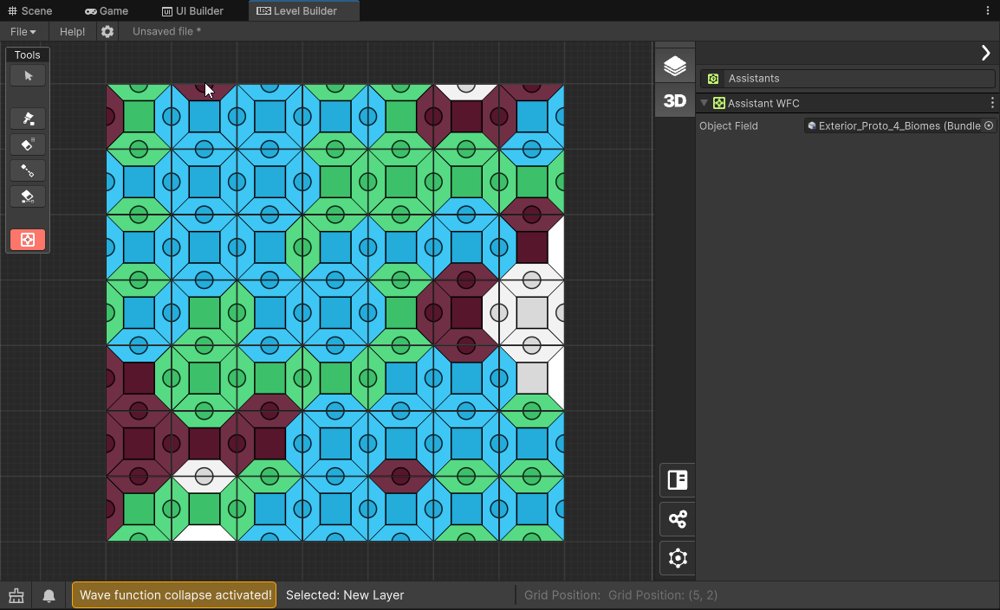
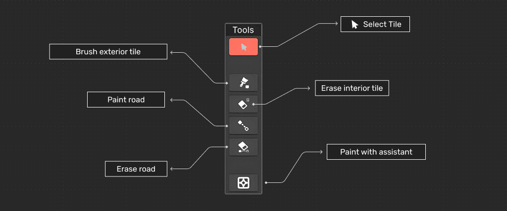
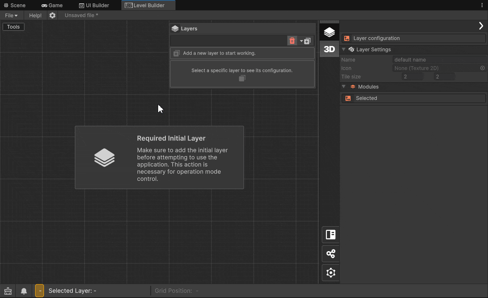
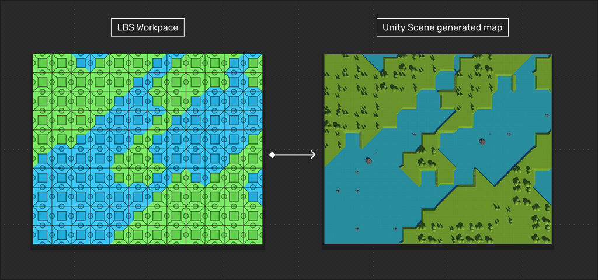

+++
date = '2025-04-09T13:02:10-04:00'
draft = false
title = 'LBS - Module 1B - Wave Function Collapse'
tags = ["Documentation","Tutorial","LBS"]
weight = 25
author = "Nicolas Acevedo"
+++

> This modules layer is design to allow create exteriors and overlord maps

### Overview 

Module 1B is focused on the creation of exteriors or tiles with connections that meet organic constraints, it allows you for example to define the paths of different boxes and to define the type of connection between them. In this module, you can use the Wave Function Collapse (WFC) wizard to define suggestions for connections.

### Tools

- **Select Tile:** Clicking on one of the tiles displays the coordinates of the tile in the tool inspector.
- **Brush Exterior Tile:** Paint tiles on the exterior type layer.
- **Delete tile:** Delete tile or group of tiles.
- **Paint Road tile:** Establish connection between tiles.
- **Delete Road tile:** You can delete connections by holding left click on the tile(s) that have connections, you must drag the mouse to delete.
- **Paint with Assistant:** With this wizard you can fill the selected area with connection suggestions using the algorithm. WFC is a constraint satisfaction algorithm.

### Workflow

### 3D Generation de Exterior Map.

