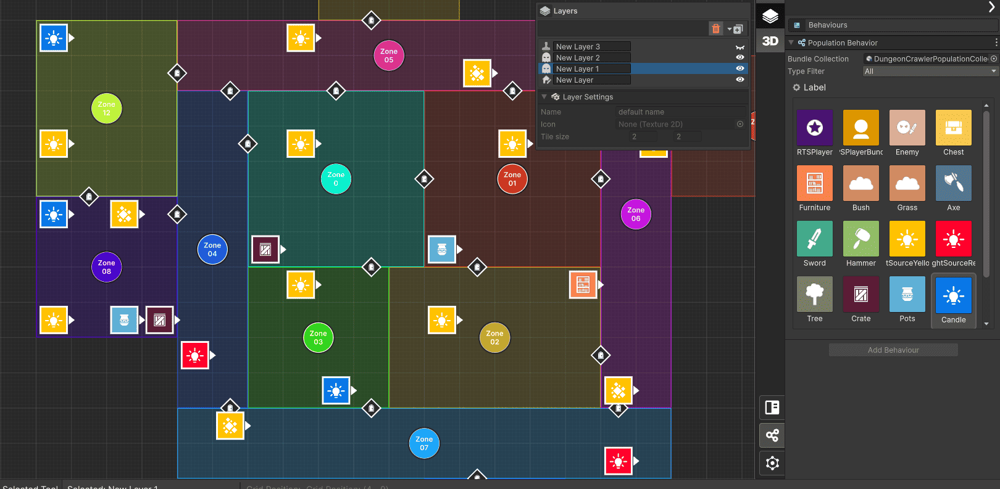

+++
title = "LBS - Module 2 - Asset Population System"
weight = 30
tags = [ "LBS", "Documentation" ]
author = "Nicolas Acevedo"

+++

> 🚧 This section is under construction.

**Module 2 - Population:** describes how the population works. In the maps created, whether exterior or interior, you can place **assets**, **entities** and **decorative elements** such as enemies, players, furniture, weapons, rewards, among others. There is also an assistant called `Map-Elites`, which is an AI that orders and generates different varieties of position of the elements on the map.

### Toolset

- **Select tool:** Select a specific item and inspect it.
- **Paint Tool:** Paint with the current item selected from the LBS inspector.
- **Erase item:** Erase a item.
- **Rotate item:** Rotate a population item.
- **Move tool:** Move a current selected item.
- **Mark Map Elites Area:** Select an area to evaluate in Map Elites Windows.

## Map Elites Windows

MAP-Elites is a classification algorithm that works in conjunction with an optimization algorithm to add diversity to the final result of the population map. The tool works with a two-dimensional map, X and Y, which will be the evaluators. In each iteration of the algorithm optimization, the result is located in the corresponding position on the map according to the score obtained. This score is based on the evaluators chosen by the assistant, with the lowest score being at the bottom left and the highest evaluation score being at the top right. The two evaluators (x and y) can be modified by the user and set as desired. The level of granularity depends on the number of partitions chosen.

## Usage
