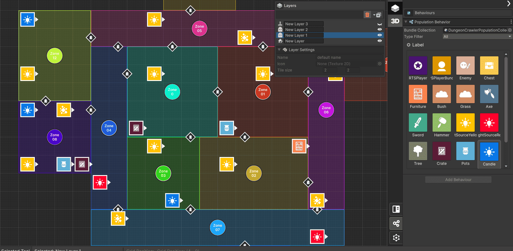

+++
title = "LBS - Modulo 2 - Asset Population System"
weight = 30
tags = [ "LBS", "Documentation" ]
author = "Nicolas Acevedo"

+++

**Módulo 2 - Población:** describe cómo funciona la población de assets. En los mapas creados, ya sean exteriores o interiores, puedes colocar **Assets**, **entidades** y **elementos decorativos** como enemigos, jugadores, muebles, armas, recompensas, entre otros. También hay un asistente llamado «Map-Elites», que es una IA que ordena y genera diferentes variedades de posición de los elementos en el mapa.