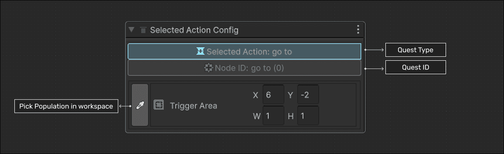
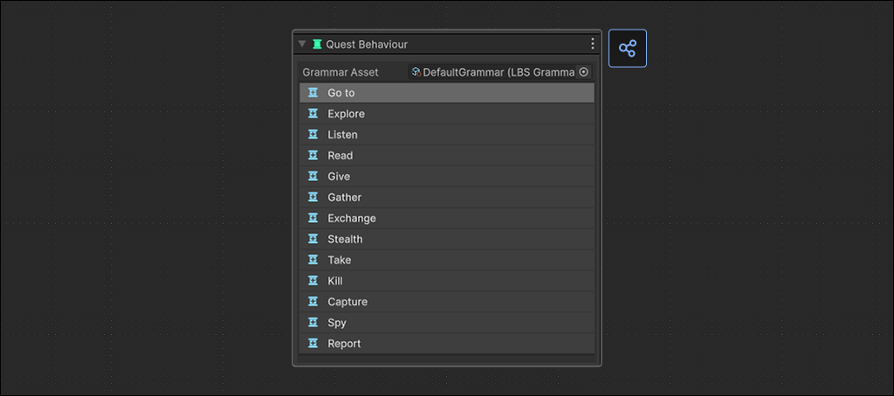

+++
title = "6. LBS - Module 3 - Quest Creation System"
draft = true
weight = 35
tags = [ "Documentation", "LBS", "Tutorial" ]
+++

Module 3 allows you to create missions consistent with the elements in the level and a predefined set of rules or grammar. It also generates an observer (events) and triggers (callbacks) in the Unity scene to manage the mission flow. You can add nodes representing actions, connect nodes, set areas where the action must be performed, generate a simple observer and trigger for each action, and indicate through color changes whether the nodes are valid according to the selected grammar.

In this module, you can also:
- Configure a mission grammar.
- Assign location, entity, or action area objectives for each grammar.
- Procedurally expand the mission tree using the wizard.
- Validate whether the map has the necessary elements to complete the mission.
- Generate and execute the mission created at runtime.

## 6.1 Quest creation.

Select the button corresponding to the quests in the `layers sidebar` menu between the **LBS inspector** and the **workspace**. Pressing it will open a layer manager window. The quest layers work the same as the other three types of windows.

When any Quest layer is selected, the following tools will be displayed.

This toolbar

## 6.2 Tool Panel

A `Quest` layer has the following work tools.

### 6.2.1 Select

Permite inspeccionar Nodos de mision especificos.

Depending on the type of node selected, you can inspect the node settings, such as the area where the quest must be carried out, the type of object related to the mission, and its quantity.

### 6.2.2 Add Node:

Allows you to add mission nodes from the mission palette.

## 6.3 Toolbox (Behavior Panel)

### Selected Quests

This panels display the configuration menu of the current selected quest allowing the designer to pick a `destination` or a `entity` in the **[workspace](/documentation/others/glossary/#workspace)**

### Quest options 

There a small number of quest tht can be chosen:

| Name | Description |
| ---- | --------- |
|**Go to** | Select a specific `destination` where the player need to go to complete the quest|
| **Explore** | Select an area where the player need to pass throw to accomplish this quest |

## 6.4 Example usage

