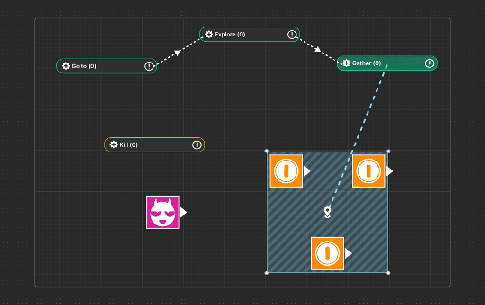
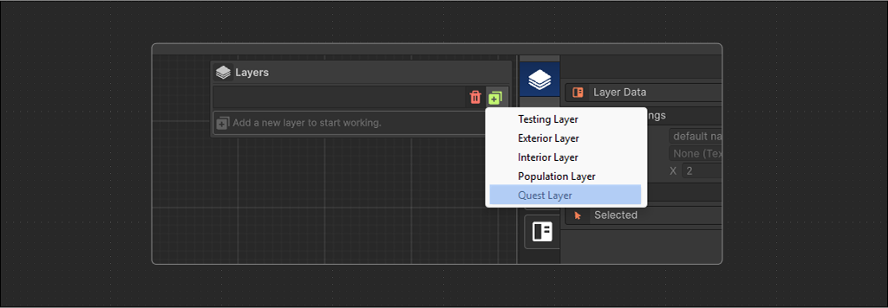
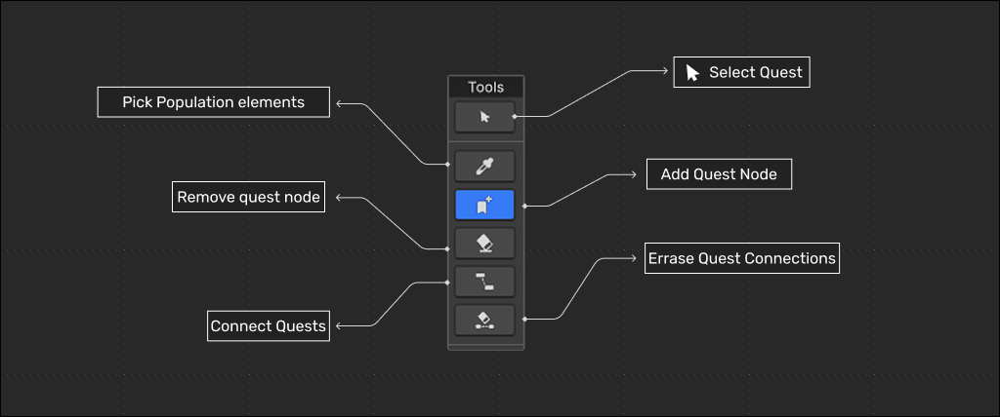
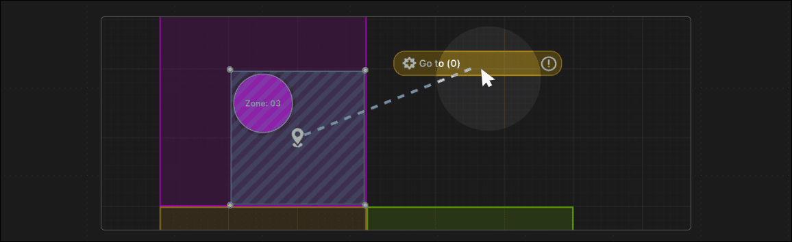
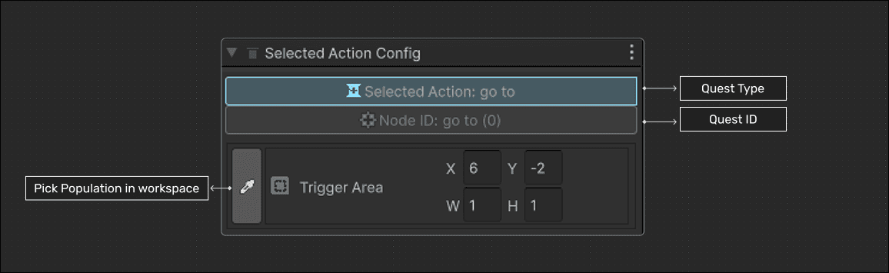
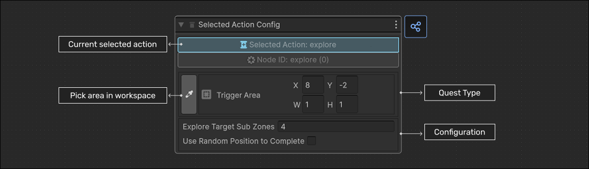
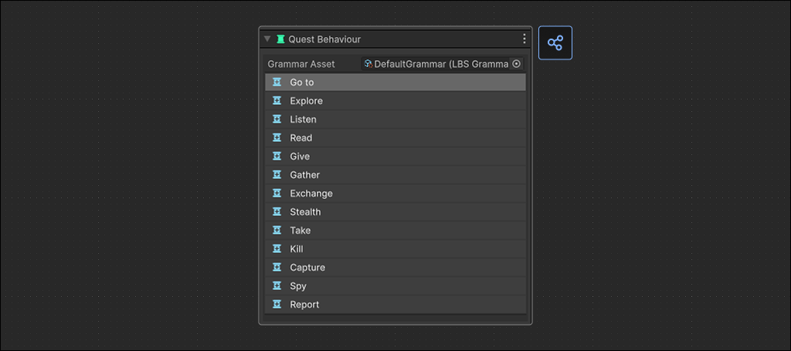

+++
title = "LBS - Modulo 3 - Sistema de Creacion de Misiones"
draft = false
weight = 35
tags = [ "Documentation", "LBS", "Tutorial" ]
author = ["Nicolas Acevedo"]

showtoc = true
tocopen = true

+++

> ⚠️ Esta pagina esta en construccion por ahora!

El Módulo 3 permite crear misiones coherentes con los elementos en el nivel y un conjunto predefinido de reglas o gramática. Además, genera un observador(eventos) y desencadenadores(callbacks) en la escena de Unity para gestionar el flujo de la misión. Puedes agregar nodos que representan acciones, conectar nodos, establecer áreas en las que se debe realizar la acción, generar un observador y desencadenador simple para cada acción e indicar mediante cambios de colores si los nodos son válidos según la gramática seleccionada. 

En este módulo también se puede:
- Configurar una gramática de la mision.
- Asignar obetivos de ubicaciones, entidades o areas de accion para cada gramatica.
- Expandir de forma procedural el árbol de la misiónes mediante el asistente.
- Validar si el mapa tiene los elementos necesarios para cumplir la misión.
- generar y ejecturar la mision creada en runtime.

## 6.1 Creacion de Quests.

Selecciona el botón pertenecientes a las quests en la barra que esta entre el inspector del LBS y el espacio de trabajo. A presionar se desplegara una ventana de administrador de capas. Las capas de quests funcionan igual que la ventana de las otros 3 tipos.

## 6.2 Panel de Herramientas

Una capa de `Quest` tiene las siguientes herramientas de trabajo.

### 6.2.1 Seleccion

Permite inspeccionar Nodos de mision especificos.

Dependiendo del tipo de nodo seleccionado, permite inspeccionar las configuraciones del nodo, como la zona donde se debe llevar a cabo la quest, el tipo de objeto relacionado con la mision y su cantidad.

### 6.2.2 Agregar nodo de misión:

Permite agregar nodos de misión desde la paleta de misiones.

## 6.3 Toolbox (Behavior)

### Quest Selecionadas

### Lista de Quest 

Posibles gramaticas a aplicar:

## 6.4 Asistente

