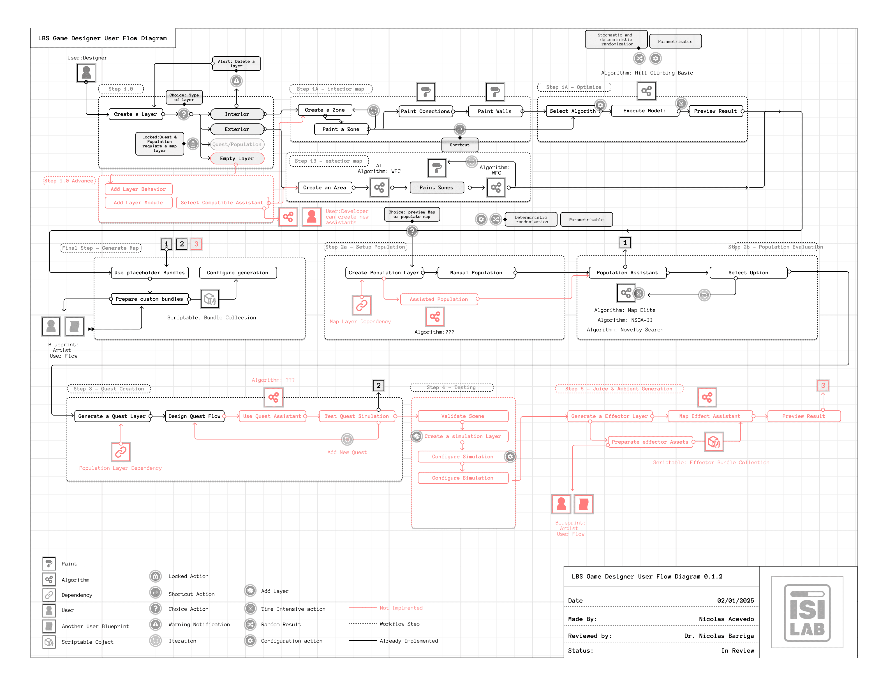
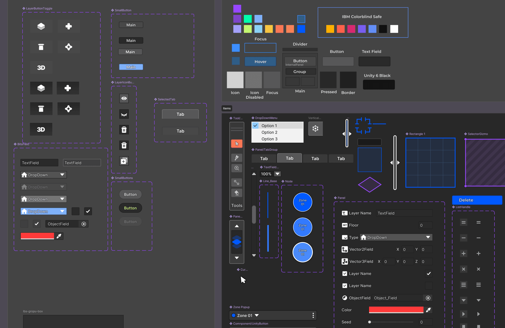

+++
date = '2025-03-23T14:45:34-03:00'
draft = true
title = 'LBS - Design Progress March 2025'
tags =  ["Post", "Article"]
author = "Nicolas Acevedo Suzarte"
+++

We are working in a new design workflow involving defining key usage cases and more!

> **Design Pilar:** The process of creating content in videogames require a lot of iteration of ideas, a fast paced design permutation capability and consistency or replicability in the results. 

As a team we established the key actors in the development process and potential use case of the tool in the context of game content creation phase.

One of the main requirements is to implement neural network algorithms for the various LBS assistants.

We know we have at least 4 steps in the feature queue, this involve:
- Step 1: Map Creation
- Step 2: Asset Populator
- Step 3: Quest Designer
- Step 4: Automatic Playtesting
 

### Visual Design

As a designer we want to take the opportunity to use the visual style and have a UI system as close as possible to how Unity handles it. This mean keep the color base color scheme, mimic the shapes and font in some cases as well.

In this case we have the opportunity to use the [atomic design](https://atomicdesign.bradfrost.com/chapter-2/) principles that allows to create a reusable asset library. That mean we can design and adjust new views in minutes